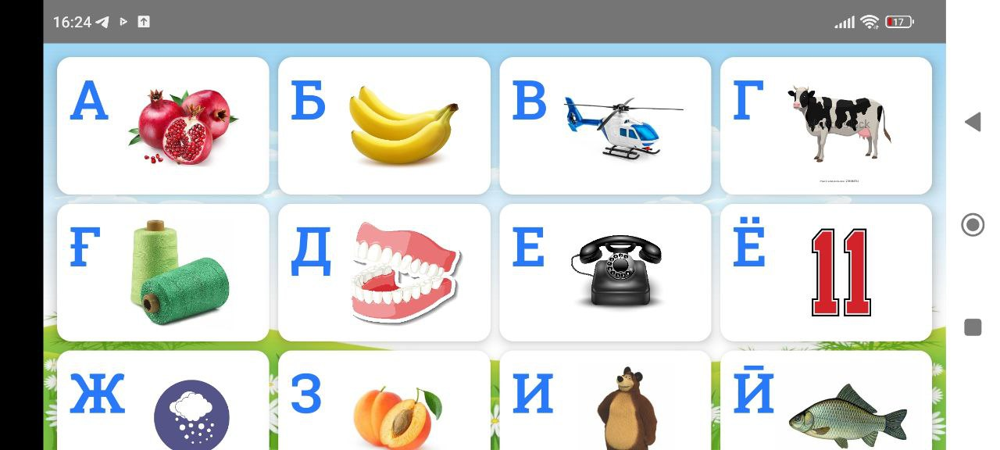
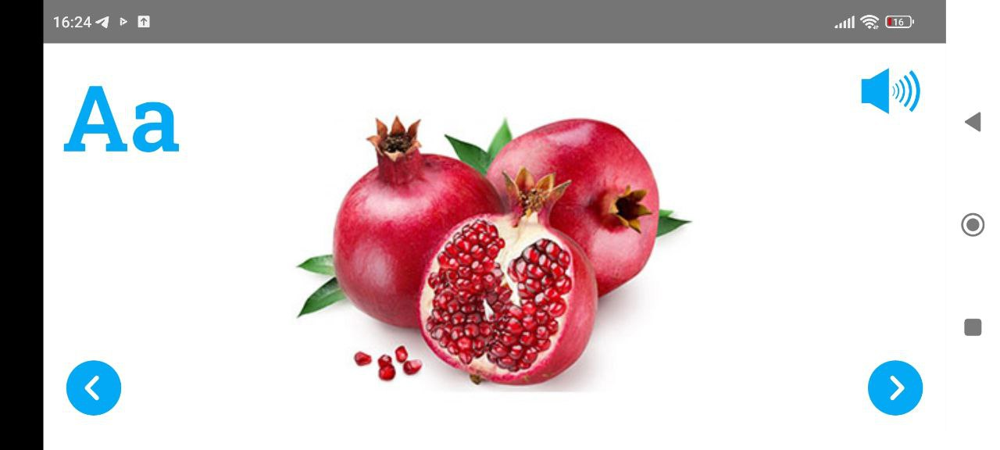

<h1 align="center">Jetpack  Compose Tajikan Alphabet</h1>

<h3 align="center">Compose Tajikan Alphabe is a sample project that presents a way of implementing UI components with Jetpack Compose.
</h3>

 &nbsp;&nbsp;
 &nbsp;&nbsp;
 &nbsp;&nbsp;
 &nbsp;&nbsp;
### Used Tech
* [Kotlin](https://kotlinlang.org/)
* [MVVM](https://developer.android.com/jetpack/docs/guide)
* [Compose](https://developer.android.com/jetpack/compose) - Modern toolkit for building native UI.
* [Ambient](https://developer.android.com/reference/kotlin/androidx/compose/Ambient) - Compose passes data through the composition tree.
* [Declarative UI Patterns](https://www.youtube.com/watch?v=VsStyq4Lzxo)
* [Lifecycles](https://developer.android.com/topic/libraries/architecture/lifecycle) - Create a UI that automatically responds to lifecycle events.
* [LiveData](https://developer.android.com/topic/libraries/architecture/livedata) - Build data objects that notify views when the underlying database changes.
* [ViewModel](https://developer.android.com/topic/libraries/architecture/viewmodel) - Store UI-related data that isn't destroyed on app rotations. Easily schedule asynchronous tasks.

## Author
Created by [Behruz Bahromzoda](https://github.com/bahromzodabehruz0220)

* Bug reports and pull requests are welcome.

